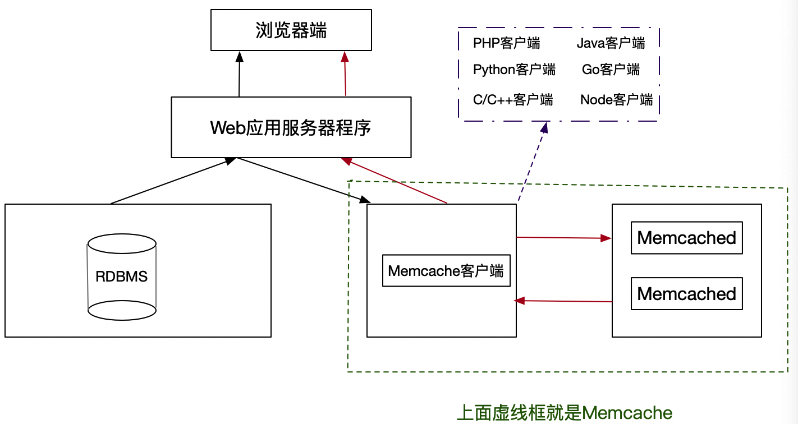
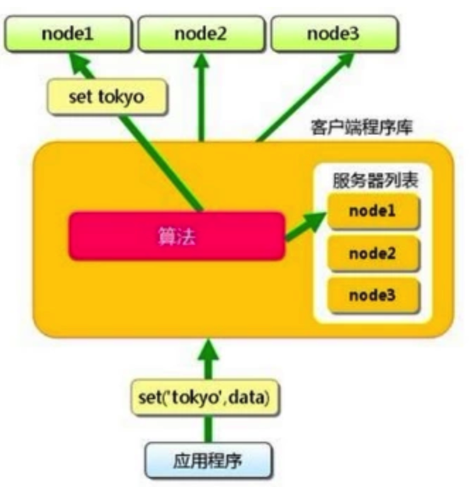
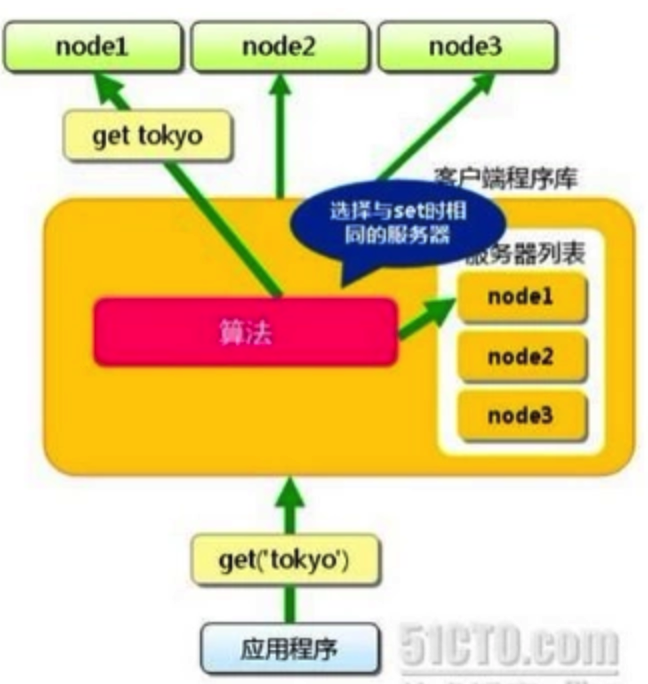
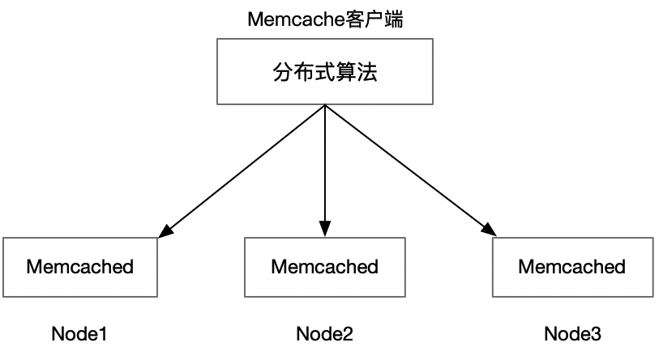

## Memcache是什么？
和Redis类似，可以将数据存储到内存里面，都是K/V类型的数据库。不过Memcache存储的结构单一，
不像Redis支持很多数据结构，并且redis支持持久化。Memcached不支持持久化，一旦宕机，数据都丢失了。
## Memcache的组成

- Memcache是一个自由和开放源代码、高性能、分配的内存对象缓存系统。用于减轻数据库负载；
- Memcached是该系统服务端项目主程序的文件名称。这里的d的英文是daemon(守护进程)，就是常驻进程的意思。
  以守护程序方式运行在一个或多个服务器中，随时接受客户端的连接操作，使用共享内存存取数据；
- Memcache客户端由各种语言实现的客户端， 包括PHP、Java和Node等等;
- 上图红色的箭头表示首次从RDBMS中获取数据，然后将数据存储到Memcache中。而红色的箭头表示第二次
  直接中Memcache中获取首次存储好的数据。
## Memcached的特点
    协议简单(使用简单的基于文本的协议);
    基于libevent的事件处理; *
    基于内存的存储方式; *
    基于客户端的分布式; *
### 基于libevent的事件处理
  1）libevent是一个程序库，他将Linux的epoll、BSD类操作系统的kqueue等时间处理功能封装成统一的接口，memcached使用libevent从而在Linux、BSD、Solaris等操作系统发挥高性能;

  2）说到epoll和kqueue，这里和NodeJs联系起来讲一下。提起NodeJs的特点，人们常常说，它是基于事件驱动，异步且非阻塞的。这里的异步非阻塞就和epoll和kqueue有关系;

  3）与异步相对应的是同步，同步会造成阻塞，从而导致CPU得不到高效的使用。内核在进行文件I/O操作时，通过文件描述符进行管理;

  4）内核在进行文件I/O操作时，通过文件描述符进行管理。应用程序如果需要进行I/O调用，必须先打开文件描述符，然后再根据文件描述符去实现文件的读写;

  阻塞I/O完成整个获取数据的过程，而非阻塞I/O不带数据直接返回，要获取数据，需要通过文件描述符进行获取。
  非阻塞I/O返回的调用的状态，不是业务层需要的数据，所以通过轮训来判断是否完成。下面是几种轮训的技术。
  - read  
    
    read是性能最低的一种，通过反复调用来检查I/O的状态来完成完整的数据读取。
  - select  
    
    select是在read上进行改进的一种方案，通过文件描述符上的事件状态来进行判断的。它是通过一个长度为1024的数组来存储状态，最多同时检查1024个文件描述符。
  - poll  
    
    通过链表来解决select数组长度的限制，但是当文件描述符较多的时候，性能还是十分低下。
  - epoll  
    
    针对大批量文件描述符，epoll在poll基础上进行了改进。epoll是Linux下效率最高的I/O事件通知机制。在进行轮训的时候如果没有检查到I/O事件，就会进行休眠。直到事件发生将它唤醒。它不浪费CPU,执行效率较高。
  - kqueue
    
    在NodeJs在0.9.0之前的版本中，它的libev模块就是模仿了libevent来实现事件轮询。在之后的版本就移除了libev模块。
 ### 基于内存的存储方式
 - 内存的结构
 
   1. slab_class里，存放的是一组组chunk大小相同的slab;
   2. 每个slab里面包含若干个page,page的默认大小是1M,如果slab大小是100M，就包含100个page;
   3. 每个page里面包含若干个chunk,chunk是数据的实际存档单位,每个slab里面的chunk大小相同。
 - 内存的分配方式
   
   常规程序使用内存一般有两种，一种是预先分配，另外一种是动态分配。动态分配从效率的角度来讲相对来慢点，
   因为它需要实时的去分配内存使用，虽然浪费了时间，但是这样做的好处是节约了内存空间。memcached采用的
   是预先分配的原则，这样的方式是拿空间换时间来提高速度，这样做会造成内存空间得不到很好的利用。
   但是memcached采用Slab Allocation机制来解决内存碎片的问题。
   Slab是按照预先规定的大小，将分配的内存分割成特定长度的块。然后将相同大小的块放在一起，形成组。
   默认相邻的slab内的chunk基本以1.25为比例进行增长，Memcache启动时哦可以用-f指定这个比例。
   例如，分配内存为942BT，Slab将这个分配为3个大小为88BT的块，3个大小为112B的块，3个114B的块，
   然后将相同大小的块放在一起。
### 基于客户端的分布式
#### 分布式总览

Client端通过IP地址和端口号指定Server端，将需要缓存的数据是以key-value对的形式保存在Server端。
key的值通过hash进行转换，根据hash值把value传递对应的具体的某个Server上。

1. 当需要获取对象数据时，也根据key进行。首先对key进行hash，通过获得的值可以确定它保存在了哪台Server上，
然后再向该Server发出请求。Client端只需知道保存hash(key)的值在哪台服务器上就可以了。
2. 当向MemCached集群存入/取出key/value时，Memcached客户端程序根据一定的算法计算存入哪台服务器，然后
再把key/value值存入到该服务器中。也就是说，存入数据分二步走，第一步，选择服务器，第二步，存取数据。
#### 分布式算法解析
1. 余数算法

先求得键的整数散列值，再除以服务器台数，根据余数确定数据存取到哪个服务器，这种方法计算简单，高效。

键Key字符串选择求余的标准有很多，可以拿字符串的ASCII码的累加，然后求余，得出具体存储到哪台服务器。

以上图为例，有3台大小相同的Memcached服务，就用3来求余数。如果余数为0，就存到Node1中；如果余数为1，
就存到Node2中；如果余数为2，就存到Node3中。比如键Key为字符串"shopid",对应的ASCII分别为115，
104，111，112，105，100,它们的和为647.拿647除以3，余数为2，那么就存到Node3服务中。

优点: 数据分布均衡在多台服务器中，适合大多数需求。
缺点: 当服务器增多，减少(Down机)和热点数据时，就无能为力了。
```
 如果原来3台服务器, 
 10 % 3 = 1, 就分配第2台服务器;
 9 % 3 = 0, 就分配到第1台服务器;
 8 % 3 = 2, 就分配到第3台服务器;

 // 如果扩容1台，变成了4台
 10 % 4 = 2, 就分配第3台服务器;
 9 % 4 = 1, 就分配第2台服务器;
 8 % 4 = 0, 就分配第1台服务器;
分析: 原来10存第2台,新增后存第3台服务器.存在第2台服务器，取的时候去第三台服务器就找不到数据了。

 // 如果Down机了1台，变成了2台
 10 % 2 = 0, 就分配第1台服务器;
 9 % 2 = 1, 就分配第2台服务器;
 8 % 2 = 0, 就分配第1台服务器;
 分析: 原来10存第2台服务器,现在存第1台服务器了，在去第2台服务器找数据就找不到了。
```
 如果确定的节点无法连接，那么将尝试的节点加到key后面，然后重新hash，从而获取对应的余数。

2. 一致性散列算法

先算出MemCached服务器的散列值，并将其分布到0到2的32次方的圆上，然后用同样的方法算出存储数据的键的散列值并映射至圆上，最后从数据映射到的位置开始顺时针查找，将数据保存到查找到的第一个服务器上，如果超过2的32次方，依然找不到服务器，就将数据保存到第一台MemCached服务器上。如果添加了一台MemCached服务器，只在圆上增加服务器的逆时针方向的第一台服务器上的键会受到影响。

例如，上图新增了一台服务器Node 4，受影响的Key只有Node3到Node4之间的，其他Key不受影响。
优点: 添加新服务器，只影响了少部分缓存的失效。现在大部分都是采用这种算法实现Memcache分布式；

## Memcached的访问模型

 1. 应用程序输入需要写缓存的数据，例如Token；
 2. Memcache API输入路由算法模块，路由算法根据Key和Memcache集群服务列表得到一台服务器编号；
 3. 由服务器编号得到Memcache及对应的IP地址和端口号；
 4. API调用通信模块和指定编号的服务器通信，将数据写入该服务器，完成一次分布式缓存的写操作。

## Memcached线程管理
MemCached默认有7个线程，4个主要的工作线程，3个辅助线程，线程可划分为以下4种：
  - 主线程，负责MemCached服务器初始化，监听TCP、Unix Domain连接请求；
  - 工作线程池，MemCached默认4个工作线程，可通过启动参数修改，负责处理TCP、UDP，Unix域套接口链路上的请求；
  - assoc维护线程，MemCached内存中维护一张巨大的hash表，该线程负责hash表动态增长；
  - slab维护线程，即内存管理模块维护线程，负责class中slab的平衡，MemCached启动选项中可关闭该线程。

## memcachehe和Redis过期键的策略
 ### 过期键删除策略的类型
  - 定时删除
  - 惰性删除
  - 定期删除
 ### Redis过期键的删除策略
  - 惰性删除
  - 定期删除
 ### Memcached过期键的删除策略
  - 惰性删除
    memcached内部不会监视记录是否过期，而是在查看记录的时间戳，检查记录是否过期。当memcached的内存空间不足的时候，
  - LRU(Least Recently Used最近最少使用)
   就从最近未被使用的记录中搜索，并将其空间分配给新的记录。
 ### 如果键已经过期了，Redis和memcache访问键获取的结果有什么不同？
  - memchache. 返回键对应的值然后删除该键和它对应的值。
  - Redis. 返回空然后删除该键和它对应的值
## 安装
 ```
   // 安装
   brew install libevent
   brew install memcached
   // 启动
   brew services memcached start
   // 检查是否启动成功
   ps -ef|grep memcached
   // 连接(默认端口 11211)
   telnet localhost 11211 
 ```
## 实操
  - 基本数据类型的操作
  - 启动时，带参数-f和不带参数f，来观察内存浪费问题
  - 启动时，带参数-M和不带M时，从而观察不使用LRU算法和使用LRU算法的删除机制
      ```
      memcached -M -m 100
      ```
  - 设置过期键以及获取过期键的值
  - 分布式
## 一些注意事项
  - Memcached单进程最大使用内存为2G；
  - 最大30天的数据过期时间，即使设置为永久过期，也会在这个时间过期；常量REALTIME_MAXDELTA为60 * 60 * 24 * 30控制；
  - 当个Item最大数据是1MB，超过1M数据不予存储，常量POWER_BLOCK 1048576进行控制；
  - 最大同时连接数是200，通过conn_init()中的freetotal进行控制，最大软连接是1024；
## Memcache适用场景
  - 访问比较频繁的数据，例如Token和首页动态；
  - 访问频繁的查询条件和结果，例如查询大V的粉丝数；
  - 作为Session的存储方式(提升Session的存取性能)；
  - 页面缓存;
  - 更新频繁的非重要的数据;(例如网站的访问量,文章的点击次数)
  - 大量的热数据;(例如直播网站在线人数)
## 与Redis相比，到底用哪个呢？
  - 安全性要求不高，数据结构是简单的K/V，就用Memcached;
  - 安全性要求很高，存储的结构复杂，数据不能丢失，一旦丢失了必须要恢复出来，那就用Redis。
## 资料
  [Memcache官网](https://memcached.org/)
- [参考一](https://www.cnblogs.com/JavaBlackHole/p/7726195.html)
- [node-memcached](https://github.com/elbart/node-memcache#readme)
- [memcached](https://github.com/memcached/memcached)
- [参考二](https://www.jianshu.com/p/b6a710a01a6a)